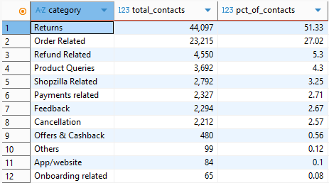
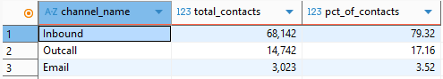
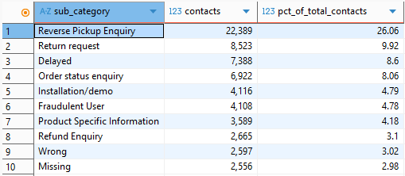

# SQL Customer Insights
Author: Gina Mills

## Project Overview

This project analyses 85,907 customer support interactions using PostgreSQL to identify the primary drivers of customer demand, channel usage patterns, response-time performance, and opportunities for operational improvement.

The objective was to move beyond simple reporting and uncover the underlying issues generating the highest support workload.

---

## Tools Used

* PostgreSQL
* DBeaver
* SQL
* GitHub

---

## Dataset

The dataset contains 85,907 customer support interactions, including:

* Contact category
* Sub-category
* Support channel
* Issue reported timestamp
* Issue responded timestamp
* Order information

---

## Business Questions

1. Which customer support categories generate the highest demand?
2. Which support channels do customers use most frequently?
3. Which specific issues generate the highest contact volume?
4. What is the average customer support response time?
5. What operational improvements could reduce support demand?

---

## Analysis Process

The analysis was completed using SQL queries to:

* Aggregate customer contacts by category
* Analyse channel usage
* Identify the highest-volume support issues
* Calculate contact percentages using window functions
* Investigate response times
* Perform data quality validation and cleaning

---

## Key Findings

### 1. Customer Demand Is Highly Concentrated

Returns accounted for 51.33% of all customer contacts.

Order Related enquiries accounted for 27.02%.

Together, these two categories generated 78.35% of all support demand.



---

### 2. Inbound Support Dominates Customer Contact

Customers overwhelmingly preferred inbound support channels.

* Inbound: 79.32%
* Outcall: 17.16%
* Email: 3.52%

This suggests that customers primarily seek real-time assistance rather than written communication.



---

### 3. Reverse Pickup Enquiries Drive Operational Demand

The largest individual support issue was Reverse Pickup Enquiry.

| Support Issue          | Contacts | % of Total Contacts |
| ---------------------- | -------: | ------------------: |
| Reverse Pickup Enquiry |   22,389 |              26.06% |
| Return Request         |    8,523 |               9.92% |
| Delayed                |    7,388 |               8.60% |
| Order Status Enquiry   |    6,922 |               8.06% |

The top four support issues accounted for more than half of all customer interactions.



---

### 4. Data Quality Investigation Improved Response-Time Analysis

Initial response-time calculations revealed negative values.

Further investigation identified records containing placeholder midnight timestamps (`00:00`), which created invalid response times.

These records were excluded from response-time calculations to improve accuracy.

After cleaning the data, the average customer support response time was:

**2 hours 56 minutes**


---

## Recommendations

Based on the findings, the following improvement opportunities were identified:

### Improve Reverse Pickup Visibility

Reverse Pickup Enquiries alone generated more than one quarter of all customer contacts.

Providing customers with better visibility of pickup status and progress could significantly reduce support demand.

### Introduce Proactive Updates

Many high-volume contact reasons appear to be information-seeking enquiries.

Proactive notifications regarding returns, pickups, and order status could reduce the need for customers to contact support.

### Expand Self-Service Options

Given the high volume of inbound contacts, self-service tracking tools could reduce operational workload while improving customer experience.

### Prioritise Return-Related Process Improvements

Returns generated over half of all support interactions and should be considered the highest-priority area for operational improvement.

---

## Skills Demonstrated

* SQL Aggregations
* GROUP BY
* ORDER BY
* Window Functions
* Data Cleaning
* Timestamp Conversion
* Data Quality Validation
* Business Analysis
* Operational Insights
* Recommendation Development

---

## Repository Contents

```text
sql-customer-insights/
│
├── README.md
├── customer_insights.sql
│
└── images
    ├── category-analysis.png
    ├── channel-analysis.png
    ├── top-subcategories.png
    └── response-time-analysis.png
```

---

## Summary

This project demonstrates the use of SQL to transform raw operational data into actionable business insights.

Through analysis of 85,907 customer support interactions, the project identified key demand drivers, validated data quality issues, quantified operational pain points, and proposed practical recommendations to improve customer experience and reduce support demand.
